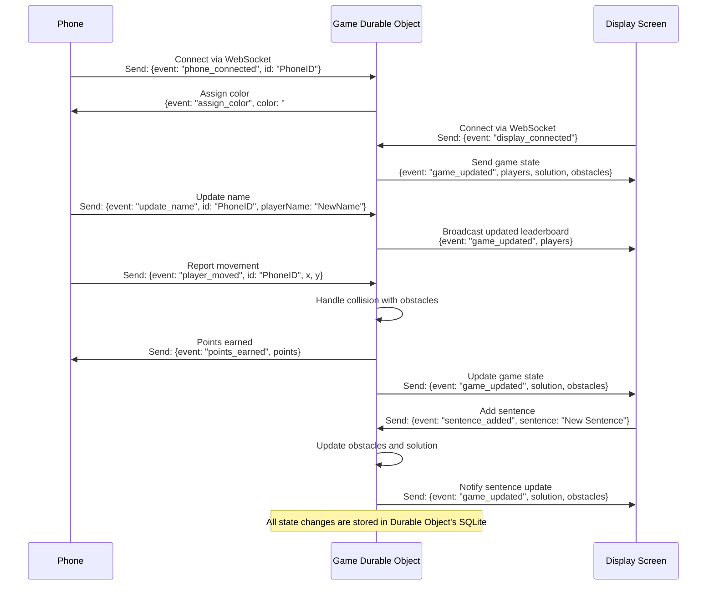

# Slicey

This was for a [Cloudflare](https://x.com/CloudflareDevs) Hack Week project to produce an educational game that we could use at [live events](https://meet-us.pages.dev) to help describe [Durable Objects](https://developers.cloudflare.com/durable-objects). It started as an attempt to build Fruit Ninja.

It uses your phone for a controller, which is something I've always wanted. This was 100% built with OpenAI GPT4o + Canvas. I went into this not knowing how to build something like this, so AI really opened things up for me. All I knew was the word tween.

AI even generated this Mermaid diagram:

**It is a bonkers time to be a builder!**

## TODO

- [ ] Make specific for events
- [ ] Add tracking (for reporting on events)
